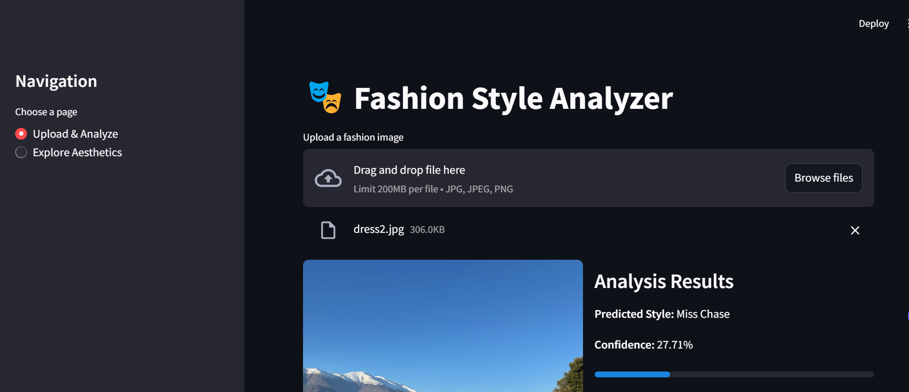

# AuraWeave - Fashion Aesthetic Analysis System

## 🎯 Features
- 🎨 15 Different Fashion Aesthetics Analysis
- 🔍 Similar Product Recommendations
- 🎨 Color Palette Extraction
- 💫 Style Elements Detection
- 🏷️ Brand Recommendations
- 📊 Confidence Scores

## 🚀 Quick Start

### Prerequisites
```bash
# Create virtual environment
python -m venv venv

# Activate virtual environment
# Windows:
.\venv\Scripts\activate
# Unix/MacOS:
source venv/bin/activate

# Install dependencies
pip install -r requirements.txt
```

### Running the Application
1. Start the FastAPI backend:
```bash
python -m uvicorn app.main:app --host 127.0.0.1 --port 8000
```

2. Start the Streamlit frontend:
```bash
streamlit run app_streamlit.py
```

3. Open browser:
- Frontend: http://localhost:8501
- API Docs: http://localhost:8000/docs

## 📦 Project Structure
```
auraweave/
├── app/
│   ├── __init__.py
│   ├── main.py              # FastAPI application
│   ├── aesthetic_definitions.py  # Aesthetic categories
│   ├── image_encoder.py     # Image processing
│   ├── color_extractor.py   # Color analysis
│   └── utils.py             # Utilities
├── models/                  # Trained models
├── app_streamlit.py         # Streamlit frontend
└── requirements.txt         # Dependencies
```

## 🎨 Supported Aesthetics
- Minimalist
- Grunge
- Office Siren
- Bohemian
- Streetwear
- Cottagecore
- Y2K
- Dark Luxury
- Athleisure
- Club Siren
- Dark Romance
- Techwear
- Indie Sleaze
- Dark Academia
- Regencycore

## 📥 Dataset Setup

### Required Data Structure
```
data/
├── fashion_dataset.csv
└── Images/
    └── Images/  # Contains product images
```

### Option 1: Download Dataset
1. Download the fashion dataset from [dataset source]
2. Place the files in the `data` directory as shown above

### Option 2: Use Sample Data
For testing, we provide a small sample dataset:
1. Download sample_data.zip from [Releases](https://github.com/Ronita2207/auraweave/releases)
2. Extract to the `data` directory

### Option 3: Use Your Own Data
Prepare your data following this format:
```csv
name,price,colour,brand,img,description
Product1,99.99,Black,BrandA,path/to/image1.jpg,Description1
Product2,149.99,White,BrandB,path/to/image2.jpg,Description2
```

## 📸 Screenshots
### Interface Screenshot


## 🤝 Contributing
Contributions welcome! Please feel free to submit a Pull Request.

## 📝 License
This project is licensed under the MIT License - see the LICENSE file for details.

[def]: image.png